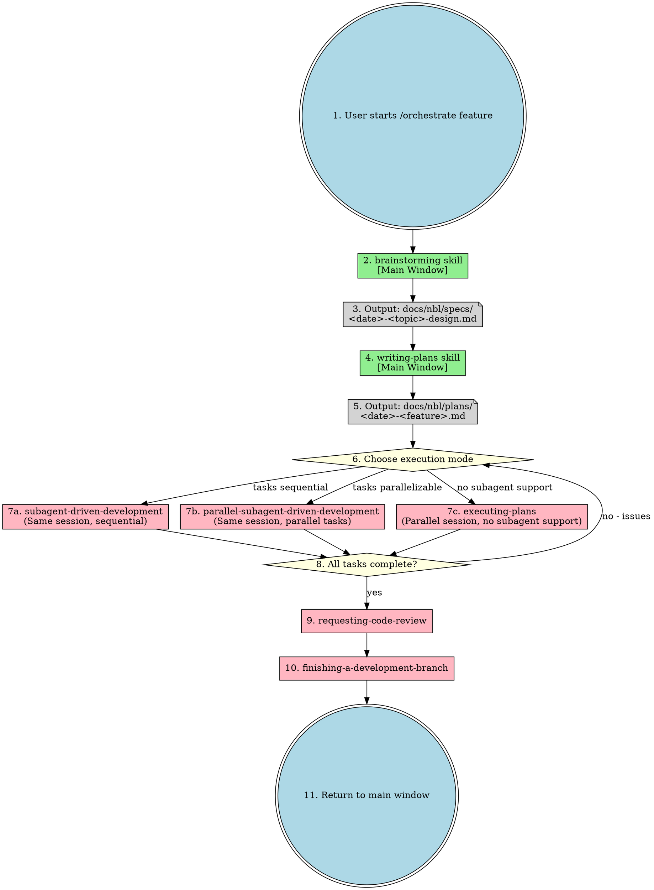
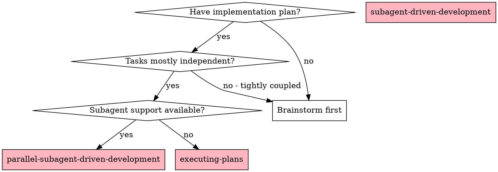
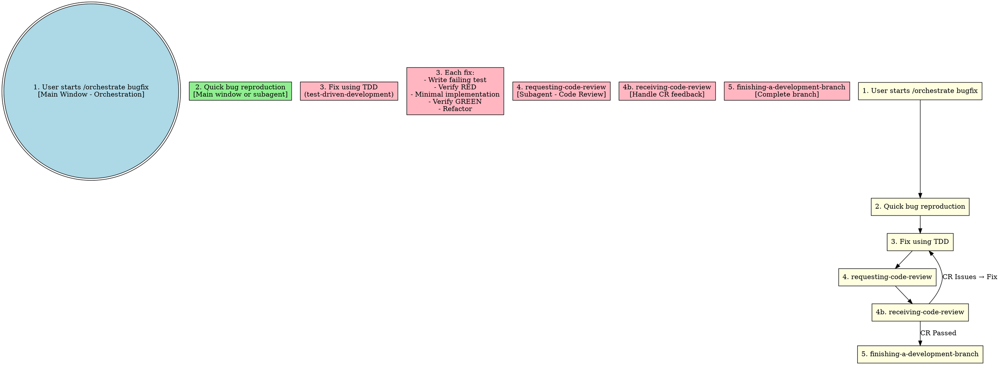
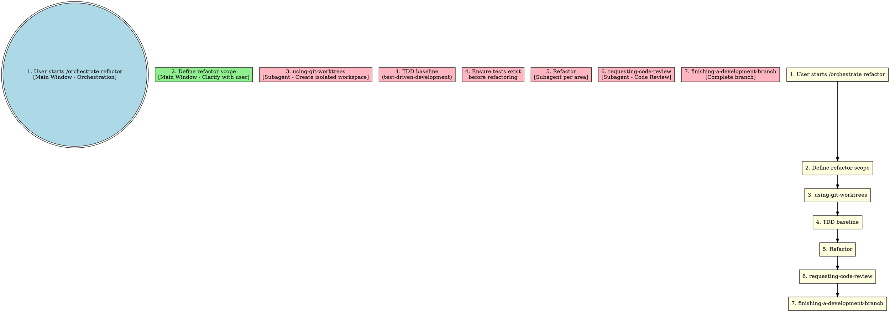

# Orchestrate Skill

Unified workflow orchestration entry point. All implementation happens in subagents. Main window handles orchestration and user interaction only.

**Core principle:** One entry point, all execution in subagents.

## Entry Points

```
/orchestrate feature "<description>"  - Feature development workflow
/orchestrate bugfix "<description>"   - Bug fix workflow
/orchestrate refactor "<description>" - Refactoring workflow
```

## Complete Feature Workflow



## Execution Mode Selection



### Mode Comparison

| Mode | Session | Execution | Best For |
|------|---------|-----------|----------|
| **parallel-subagent-driven-development** | Same | Parallel (max 5) | Independent tasks, fast iteration |
| **subagent-driven-development** | Same | Sequential | Tightly coupled tasks |
| **executing-plans** | Parallel | Sequential | No subagent support |

## Bugfix Workflow



## Refactor Workflow



## Skill Dependencies

| Skill | Execution | Purpose |
|-------|-----------|---------|
| **orchestrate** | Main window | Unified entry point |
| **brainstorming** | Main window | Requirements clarification |
| **writing-plans** | Main window | Detailed plan with task dependencies |
| **using-git-worktrees** | Subagent | Isolated workspace (single or batch mode) |
| **subagent-driven-development** | Subagent | Sequential task execution in same session |
| **parallel-subagent-driven-development** | Subagent | Parallel task execution (max 5) in same session |
| **executing-plans** | Parallel session | Sequential execution without subagent support |
| **test-driven-development** | Subagent | TDD cycle |
| **requesting-code-review** | Subagent | Code review |
| **receiving-code-review** | Subagent | Handle CR feedback |
| **finishing-a-development-branch** | Subagent | Complete branch |

## When to Use

| Scenario | Workflow | Execution Mode |
|----------|----------|----------------|
| New feature (complex) | feature | writing-plans → parallel-subagent-driven-development |
| New feature (simple) | feature | writing-plans → subagent-driven-development |
| Bug fix | bugfix | TDD → subagent |
| Safe refactoring | refactor | TDD baseline → subagent |
| Multi-subsystem project | feature (decomposed) | Separate plan per subsystem |
| No subagent support | any | executing-plans |

## Decision Logic

```
Is this a creative/implementation task?
  └── YES → Use brainstorming first (main window)
       └── After brainstorming:
            └── writing-plans (with task dependencies)
       └── After plan:
            ├── Build dependency graph from task dependencies
            ├── Analyze task independence
            └── Choose execution mode:
                 ├── Independent tasks + subagent support?
                 │   └── parallel-subagent-driven-development (max 5 parallel)
                 ├── Tightly coupled + subagent support?
                 │   └── subagent-driven-development (sequential)
                 └── No subagent support?
                     └── executing-plans (parallel session)
  └── NO (simple/known) → Skip brainstorming
       └── Direct to appropriate workflow
```

## Red Flags

**Never:**
- Implement in main window (all work in subagents)
- Skip brainstorming for creative tasks
- Skip TDD for bug fixes
- Skip code review
- Skip CR feedback handling
- Start implementation on main/master branch without worktree isolation

**Always:**
- Use orchestrate as single entry point
- Dispatch subagents for all implementation
- Handle CR feedback before proceeding
- Use worktree isolation before implementation
