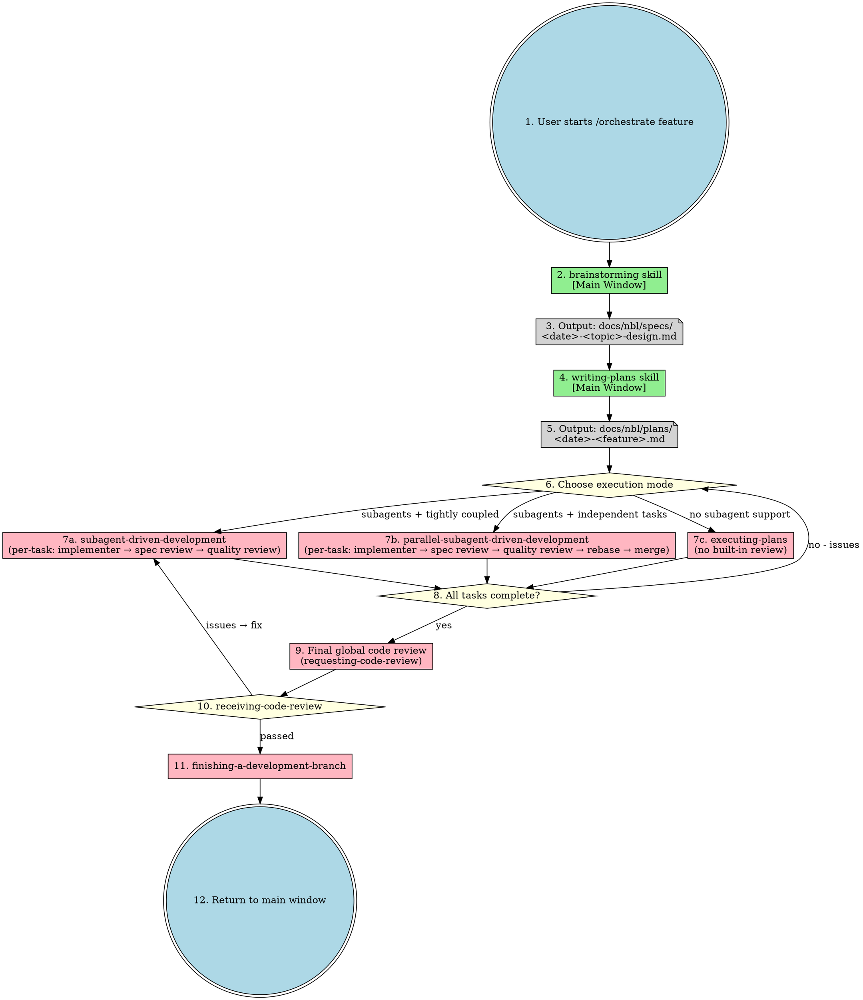
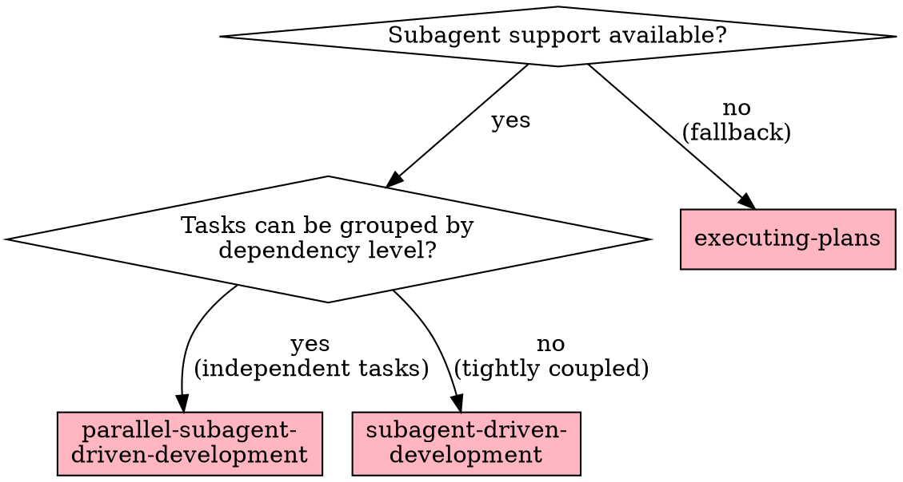
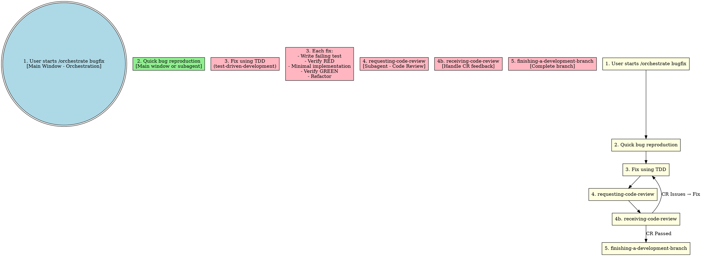
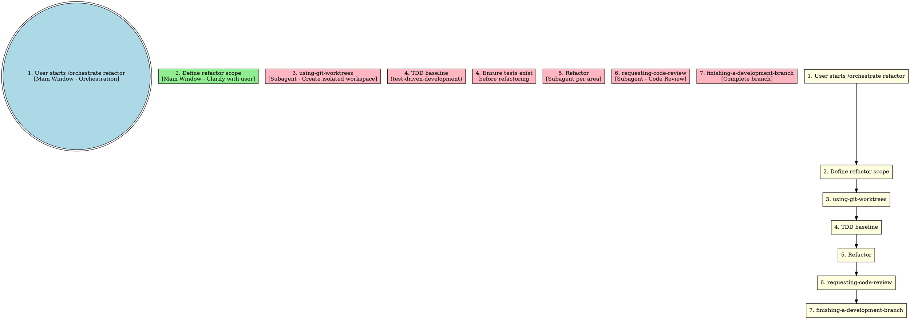

# Orchestrate Skill

Unified workflow orchestration entry point. All implementation happens in subagents. Main window handles orchestration and user interaction only.

**Core principle:** One entry point, all execution in subagents.

## Entry Points

```
/orchestrate feature "<description>"  - Feature development workflow
/orchestrate bugfix "<description>"   - Bug fix workflow
/orchestrate refactor "<description>" - Refactoring workflow
```

## Complete Feature Workflow



### Code Review 出现在两个层级

| 层级 | 时机 | 内容 | 处理方式 |
|------|------|------|---------|
| **任务级**（内置在 7a/7b 中） | 每个任务完成后 | Stage 1: Spec Review → Stage 2: Quality Review | 实现子代理修复 → 重新审查 → 循环直到通过 |
| **全局级**（步骤 9-10） | 所有任务完成后 | 整体代码审查 | receiving-code-review 处理反馈 → 有问题则返回修复 → 通过则继续 |

**注意：** executing-plans（7c）没有内置任务级审查，因此全局审查（步骤 9）是其唯一的代码质量保障。

## Execution Mode Selection

到达此阶段时，brainstorming 和 writing-plans 已完成，已有实现计划在手。决策依据两个维度：**是否有子代理支持**、**任务间是否独立**。



### Mode Comparison

| 维度 | parallel-subagent-driven-development | subagent-driven-development | executing-plans |
|------|-------------------------------------|----------------------------|-----------------|
| **子代理** | 有（每任务一个） | 有（每任务一个） | **无**（主代理自行执行） |
| **并行度** | 同层并行（max 5） | 无（严格顺序） | 无（严格顺序） |
| **会话** | 同一会话 | 同一会话 | **独立会话** |
| **审查机制** | 两阶段（spec + quality） | 两阶段（spec + quality） | **无内置审查** |
| **worktree** | 批量创建（每层） | 单个创建 | 仅建议（非强制） |
| **rebase/merge** | 每任务 rebase → merge 到 base | 不需要（顺序无冲突） | 不需要 |
| **冲突处理** | 内置 LLM 自动解决 rebase 冲突 | 无冲突风险 | 无冲突风险 |
| **层级屏障** | 有（同层全部通过才进入下层） | 无 | 无 |
| **质量保障** | 最高（并行 + 两阶段审查 + 层级屏障） | 高（两阶段审查） | **最低**（无审查） |
| **成本** | 最高（多子代理 + 多次审查） | 中等 | 最低 |
| **适用平台** | Claude Code / Codex | Claude Code / Codex | **无子代理的平台（降级）** |
| **最佳场景** | 计划中有多个独立任务，追求速度 | 任务间紧耦合或计划较简单 | 子代理不可用时的降级方案 |

### Decision Logic

```
子代理可用？
├── YES → 任务能按依赖层级分组？
│   ├── YES → parallel-subagent-driven-development
│   │        （同层任务并行执行，层级屏障确保顺序）
│   └── NO  → subagent-driven-development
│             （任务紧耦合，顺序执行避免冲突）
└── NO  → executing-plans
          （降级方案：独立会话，主代理顺序执行）
```

**选择建议：**
- **默认选择并行模式** — 大多数计划都包含可并行的独立任务，层级屏障保证了依赖顺序，是质量和效率的最佳平衡
- **计划仅 1-2 个任务且紧耦合** → 顺序模式足够
- **子代理不可用** → executing-plans 是唯一选择，但质量保障显著降低

## Bugfix Workflow



## Refactor Workflow



## Skill Dependencies

| Skill | Execution | Purpose |
|-------|-----------|---------|
| **orchestrate** | Main window | Unified entry point |
| **brainstorming** | Main window | Requirements clarification |
| **writing-plans** | Main window | Detailed plan with task dependencies |
| **using-git-worktrees** | Subagent | Isolated workspace (single or batch mode) |
| **subagent-driven-development** | Subagent | Sequential task execution in same session |
| **parallel-subagent-driven-development** | Subagent | Parallel task execution (max 5) in same session |
| **executing-plans** | Parallel session | Sequential execution without subagent support |
| **test-driven-development** | Subagent | TDD cycle |
| **requesting-code-review** | Subagent | Code review |
| **receiving-code-review** | Subagent | Handle CR feedback |
| **finishing-a-development-branch** | Subagent | Complete branch |

## When to Use

| Scenario | Workflow | Execution Mode |
|----------|----------|----------------|
| New feature (complex) | feature | writing-plans → parallel-subagent-driven-development |
| New feature (simple) | feature | writing-plans → subagent-driven-development |
| Bug fix | bugfix | TDD → subagent |
| Safe refactoring | refactor | TDD baseline → subagent |
| Multi-subsystem project | feature (decomposed) | Separate plan per subsystem |
| No subagent support | any | executing-plans |

## Decision Logic

```
Is this a creative/implementation task?
  └── YES → Use brainstorming first (main window)
       └── After brainstorming:
            └── writing-plans (with task dependencies)
       └── After plan:
            ├── Build dependency graph from task dependencies
            ├── Analyze task independence
            └── Choose execution mode:
                 ├── Independent tasks + subagent support?
                 │   └── parallel-subagent-driven-development (max 5 parallel)
                 ├── Tightly coupled + subagent support?
                 │   └── subagent-driven-development (sequential)
                 └── No subagent support?
                     └── executing-plans (parallel session)
  └── NO (simple/known) → Skip brainstorming
       └── Direct to appropriate workflow
```

## Red Flags

**Never:**
- Implement in main window (all work in subagents)
- Skip brainstorming for creative tasks
- Skip TDD for bug fixes
- Skip code review
- Skip CR feedback handling
- Start implementation on main/master branch without worktree isolation

**Always:**
- Use orchestrate as single entry point
- Dispatch subagents for all implementation
- Handle CR feedback before proceeding
- Use worktree isolation before implementation
