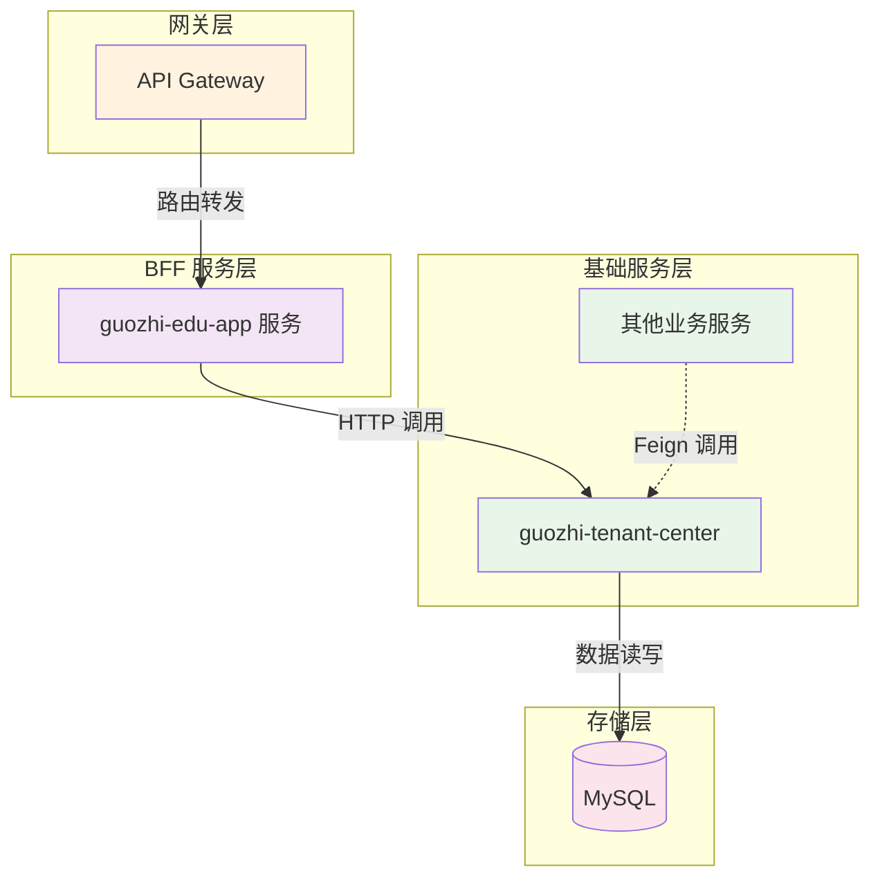

## 1. 需求背景

### 1.1 业务背景

这里抽象基础数据中的通用逻辑，作为跨业务域复用的设计基线。

### 1.2 核心功能

- 归档
- 基础数据变更同步

---

## 2. 整体架构设计

### 2.1 系统架构图

> 流程：前端请求 -> gateway -> guozhi-edu-app 服务 -> 基础数据服务（guozhi-tenant-center）-> 存储层；同时基础数据服务也向业务服务提供 Feign 接口。



---

## 3. 技术设计

### 3.1 功能 A

#### 3.1.1 流程图

_复杂功能需要详细流程图。_

#### 3.1.2 时序图

_调用关系复杂时，补充时序图描述。_

---

## 4. API 设计

### 4.1 接口列表

| 接口名称 | HTTP 方法 | 路径 | 说明 |
| --- | --- | --- | --- |
| 创建学期（包括小学段维护） | POST | /semesters/insert | |

### 4.2 接口详细设计

#### 4.2.1 上报审计数据

**请求信息**

```json

```

**请求参数**

```json

```

**响应示例**

成功响应：

```json
{
  "code": 0,
  "message": "成功",
  "data": null
}
```

失败响应：

```json
{
  "code": 42001,
  "message": "参数为空",
  "data": null
}
```

### 4.3 消息队列（MQ）

**消息格式**

---

## 5. 模型设计

### 新建表

```sql

```

### 更新表

```sql
ALTER TABLE xxx
ADD INDEX idx_xxx (xxx);
```
